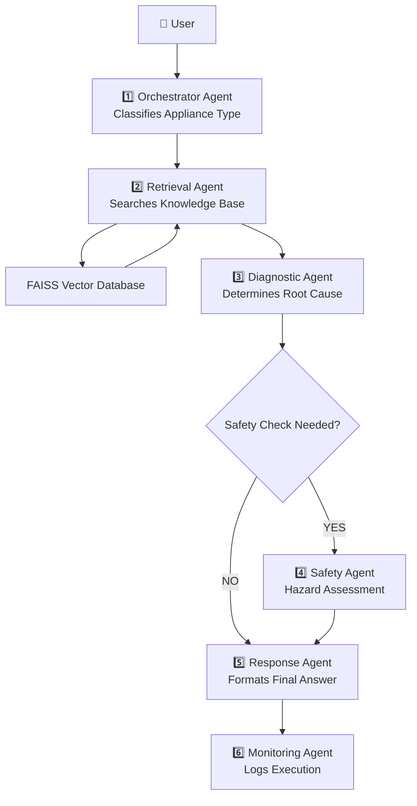
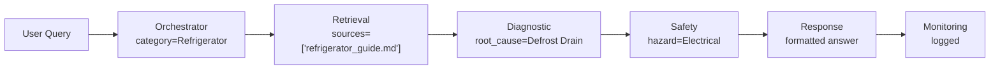
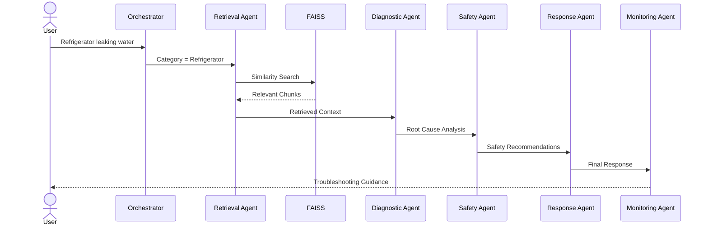

# 🏠 Household Appliance Troubleshooting Agent — Updated Walkthrough

> This document describes the upgraded multi-agent Retrieval-Augmented Generation (RAG) system for diagnosing common household appliance issues using a knowledge base, vector retrieval, Hugging Face LLMs, LangGraph orchestration, and monitoring.

---

# 📁 Project Structure

```text
household-appliance-agent/
│
├── .env                          ← HF_TOKEN configuration
├── run.py                        ← CLI entry point
├── requirements.txt
├── run.txt                       ← Setup instructions
│
├── knowledge_base/               ← Appliance troubleshooting documents (RAG source)
│   ├── refrigerator_guide.md
│   ├── washing_machine_guide.md
│   ├── microwave_guide.md
│   ├── air_conditioner_guide.md
│   ├── dishwasher_guide.md
│   └── vacuum_cleaner_guide.md
│
├── chroma_db/                    ← Embedded vector database (Chroma/FAISS)
│
├── logs/
│   └── execution.json            ← Monitoring + execution trace logs
│
└── app/
    ├── llm.py                    ← Hugging Face Llama-3.1 inference wrapper
    │
    ├── agents/
    │   ├── orchestrator.py       ← Appliance intent classification
    │   ├── retrieval_agent.py    ← RAG-based knowledge retrieval
    │   ├── diagnostic_agent.py   ← Root cause analysis
    │   ├── safety_agent.py       ← Risk detection (critical safety layer)
    │   ├── response_agent.py     ← Final structured response generation
    │   └── monitoring_agent.py   ← Execution tracking + observability
    │
    ├── rag/
    │   ├── ingest.py             ← Load markdown into vector DB
    │   ├── embeddings.py         ← HuggingFace embeddings
    │   ├── vectordb.py           ← Vector DB initialization
    │   └── retriever.py         ← MMR-based retrieval pipeline
    │
    ├── workflows/
    │   ├── state.py              ← Shared agent state definition
    │   └── graph.py             ← LangGraph orchestration pipeline
    │
    ├── tools/
    │   └── appliance_tools.py    ← Sensor + safety + utility tools
    │
    └── ui/
        └── streamlit_app.py      ← Interactive monitoring dashboard
```

---

# 🏗️ System Architecture



---

# 🎯 Business Problem

Homeowners frequently experience appliance issues such as:

* Refrigerator not cooling
* Washing machine not draining
* Microwave sparking
* Air conditioner leaking water
* Dishwasher not cleaning dishes

Many users cannot identify the cause or determine whether an issue is safe to troubleshoot themselves.

This system provides:

* Context-aware troubleshooting
* Root-cause analysis
* Safety recommendations
* Retrieval-backed responses

---

# 📚 Knowledge Base

The knowledge base consists of Markdown documents.

Example:

```text
refrigerator_guide.md
washing_machine_guide.md
microwave_guide.md
air_conditioner_guide.md
dishwasher_guide.md
vacuum_cleaner_guide.md
```

Each document contains:

* Problems
* Causes
* Solutions
* Safety precautions

Example:

```markdown
Problem: Refrigerator Not Cooling

Possible Causes:
- Dirty condenser coils
- Faulty thermostat

Solution:
- Clean condenser coils
- Inspect thermostat
```

---

# 🔍 Retrieval-Augmented Generation (RAG)

The project uses RAG to ground LLM responses in appliance documentation.

Workflow:

```text
Markdown Files
      │
      ▼
Chunking
      │
      ▼
Embeddings
      │
      ▼
FAISS Vector DB
      │
      ▼
Similarity Search
      │
      ▼
Relevant Context
      │
      ▼
LLM Reasoning
```

---

# 🧠 Agent Overview

## 1️⃣ Orchestrator Agent

Purpose:

Identify appliance category and route request.

Example:

User Query:

```text
My refrigerator is leaking water.
```

Agent Output:

```text
CATEGORY: Refrigerator
RETRIEVAL_REQUIRED: YES
```

Responsibilities:

* Classify appliance
* Determine retrieval requirement
* Initialize workflow state

---

## 2️⃣ Retrieval Agent

Purpose:

Retrieve relevant troubleshooting information.

Uses:

* Sentence Transformers
* FAISS Vector Search

Example:

Query:

```text
Refrigerator leaking water
```

Retrieved Sources:

```text
refrigerator_guide.md
```

Retrieved Context:

```text
Problem: Water Leakage

Possible Causes:
- Clogged defrost drain
- Cracked water supply line
```

---

## 3️⃣ Diagnostic Agent

Purpose:

Determine root cause using retrieved context.

Structured Output:

```text
APPLIANCE: Refrigerator

ROOT_CAUSE:
Clogged defrost drain

CONFIDENCE:
88%

REQUIRES_SAFETY_CHECK:
YES
```

Responsibilities:

* Analyze retrieved knowledge
* Determine likely cause
* Generate confidence score

---

## 4️⃣ Safety Agent

Purpose:

Determine if troubleshooting may involve hazards.

Examples:

| Appliance Issue         | Hazard            |
| ----------------------- | ----------------- |
| Microwave Repair        | High Voltage      |
| AC Refrigerant Leak     | Chemical Exposure |
| Refrigerator Compressor | Electrical Hazard |

Example Output:

```text
WARNING:

Disconnect appliance from power before inspection.

Do not open microwave housing due to high-voltage capacitor risk.
```

---

## 5️⃣ Response Agent

Purpose:

Generate user-friendly response.

Output Format:

```markdown
## Diagnosis

Likely Cause:
Clogged defrost drain

## Recommended Actions

1. Disconnect power.
2. Locate drain opening.
3. Remove debris.

## Safety Notice

Disconnect appliance before inspection.

## Sources

refrigerator_guide.md
```

---

## 6️⃣ Monitoring Agent

Purpose:

Track workflow performance.

Records:

* Query
* Sources retrieved
* Latency
* Agent execution path
* Final status

Log Example:

```json
{
  "query": "Microwave sparks when running",
  "category": "Microwave",
  "sources": ["microwave_guide.md"],
  "latency_seconds": 4.82,
  "status": "success"
}
```

---

# 🔬 State Object

The workflow passes a shared state object through all agents.

```python
class AgentState(TypedDict):

    query: str

    category: str

    retrieved_docs: List[str]

    sources: List[str]

    diagnosis: str

    safety_report: str

    response: str

    execution_path: List[str]

    monitoring: Dict

    start_time: float

    error: str
```

---

# 🔄 State Evolution



---

# ⚙️ Workflow Execution

## Step 1

User enters:

```text
My refrigerator is leaking water.
```

---

## Step 2

Orchestrator identifies:

```text
CATEGORY:
Refrigerator
```

---

## Step 3

Retrieval Agent searches FAISS.

Retrieved:

```text
Water Leakage

Possible Causes:
- Clogged defrost drain
- Cracked water line
```

---

## Step 4

Diagnostic Agent reasons:

```text
ROOT CAUSE:
Clogged defrost drain

CONFIDENCE:
88%
```

---

## Step 5

Safety Agent evaluates:

```text
Disconnect power before inspection.
```

---

## Step 6

Response Agent generates:

```markdown
Diagnosis:
Clogged defrost drain

Steps:
1. Disconnect power.
2. Locate drain.
3. Remove blockage.

Safety:
Disconnect appliance before inspection.
```

---

## Step 7

Monitoring Agent logs:

```json
{
  "workflow_status":"success",
  "latency_seconds":4.82
}
```

---

# 📊 Sequence Diagram



---

# 📈 Monitoring Metrics

Tracked Metrics:

| Metric              | Description          |
| ------------------- | -------------------- |
| Query Count         | Total requests       |
| Retrieval Time      | FAISS search latency |
| LLM Latency         | Inference time       |
| Total Workflow Time | End-to-end execution |
| Sources Retrieved   | Documents used       |
| Success Rate        | Completed workflows  |

---

# 🧩 Technology Stack

| Component       | Technology              |
| --------------- | ----------------------- |
| LLM             | Phi-3 Mini / Mistral 7B |
| Agent Framework | LangGraph               |
| Retrieval       | LangChain               |
| Embeddings      | all-MiniLM-L6-v2        |
| Vector Database | FAISS                   |
| Knowledge Base  | Markdown Documents      |
| Monitoring      | JSON Logs               |
| UI              | Streamlit               |

---

# 🎤 Viva / Interview Explanation

"I developed a multi-agent RAG-based Household Appliance Troubleshooting Agent using LangGraph and Hugging Face models.

The Orchestrator Agent classifies the appliance type and routes the request.

The Retrieval Agent performs semantic search over a FAISS vector database built from appliance troubleshooting manuals.

The Diagnostic Agent analyzes retrieved context to determine the most likely root cause.

A Safety Agent evaluates electrical, mechanical, or chemical hazards before recommendations are presented.

The Response Agent generates structured troubleshooting guidance grounded in retrieved documents.

Finally, the Monitoring Agent tracks execution latency, retrieved sources, and workflow status, creating a complete audit trail of every interaction."
